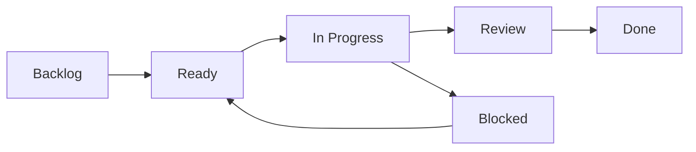

# AGENTS.md Kanban Snippet

Add this to projects that should use Agent Kanban autonomously.

```md
## Agent Kanban

Use the `agent-kanban` CLI for development task state. Use the MCP adapter only when this client cannot run the CLI directly.

At session start:
- Run `agent-kanban context --cwd <current-project-dir>` or `agent-kanban start --cwd <current-project-dir> --session <stable-id>`.
- The board is stored inside the current project at `<project-root>/.kanban/kanban-data.json`; do not use `~/wiki/Kanban` for agent session state.
- If the returned context has an active card, continue that card.
- If no active card exists, claim the highest-priority ready card before editing files.
- If no ready card exists, create a card before starting new implementation work.

During work:
- Run `agent-kanban claim <card-id> --cwd <current-project-dir> --session <stable-id>` before making file changes for a card.
- Pass the current project `cwd` to every mutation command, so the CLI routes to the right project-local board.
- Run `agent-kanban progress ...` after meaningful implementation steps, including changed files, next action, and test results when available.
- Run `agent-kanban block ...` with a concrete blocker when work cannot continue without user input.

At finish:
- Run `agent-kanban done ...` only after verification.
- Run `agent-kanban end ...` with a concise outcome summary before ending the turn.
- Do not silently work outside the board unless the user explicitly asks for work that should not be tracked.

MCP fallback:
- `kanban_context` maps to `agent-kanban context`.
- `kanban_run` accepts the CLI args after the binary name.
```

Recommended column meanings:


