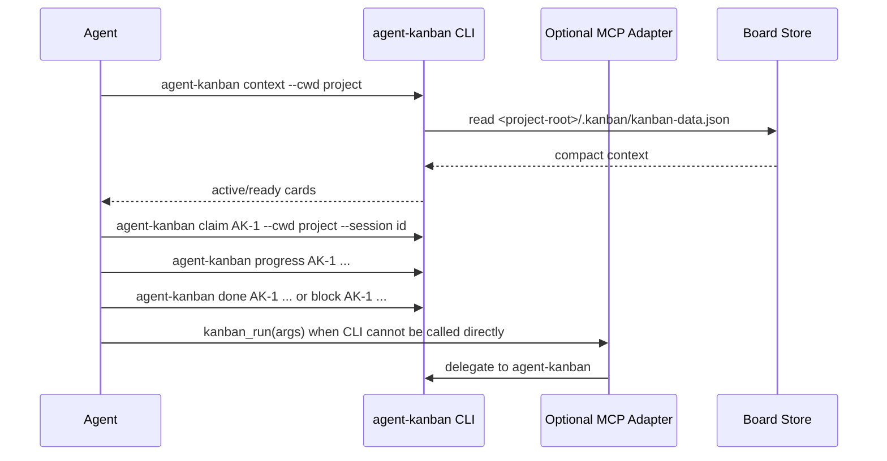

# MCP Adapter Contract

The server name is `agent-kanban`.

Board state is project-local. The MCP server resolves the project root from the `cwd` argument and writes to:

```txt
<project-root>/.kanban/kanban-data.json
```

Use `KANBAN_DATA_PATH` only for tests or intentional one-off overrides.

## Tools

- `kanban_context`: compact read-only context for session start. This maps to `agent-kanban context`.
- `kanban_run`: runs one explicit `agent-kanban` CLI command. This is the mutation path and keeps MCP schema overhead small.

Examples:

```json
{ "cwd": "/Users/kangnam/projects/example-app", "branch": "main", "session": "codex-20260510" }
```

```json
{ "args": ["claim", "AK-1", "--cwd", "/Users/kangnam/projects/example-app", "--session", "codex-20260510"] }
```

```json
{ "args": ["progress", "AK-1", "--cwd", "/Users/kangnam/projects/example-app", "--msg", "Added validation tests", "--files", "src/settings.ts,tests/settings.test.ts"] }
```

## Expected agent loop


